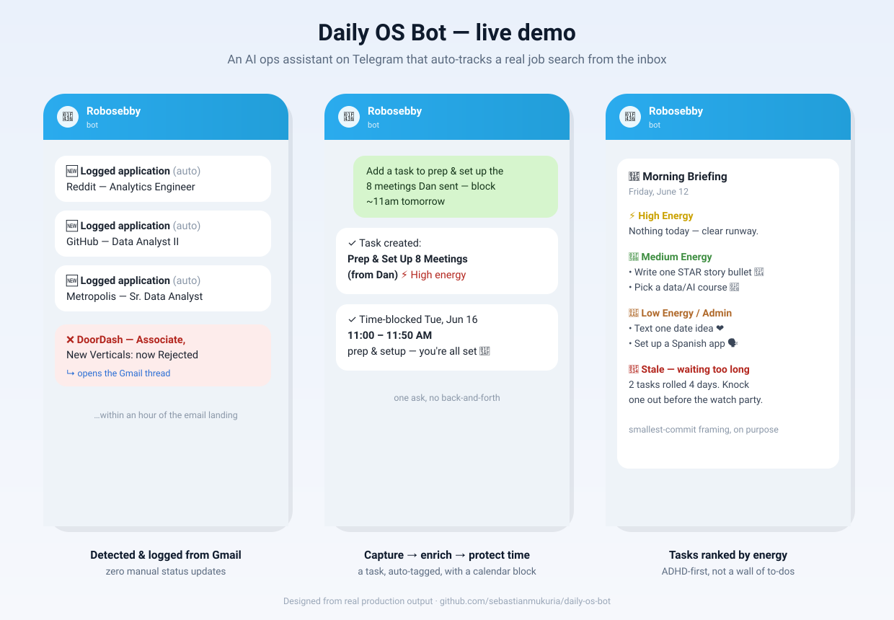
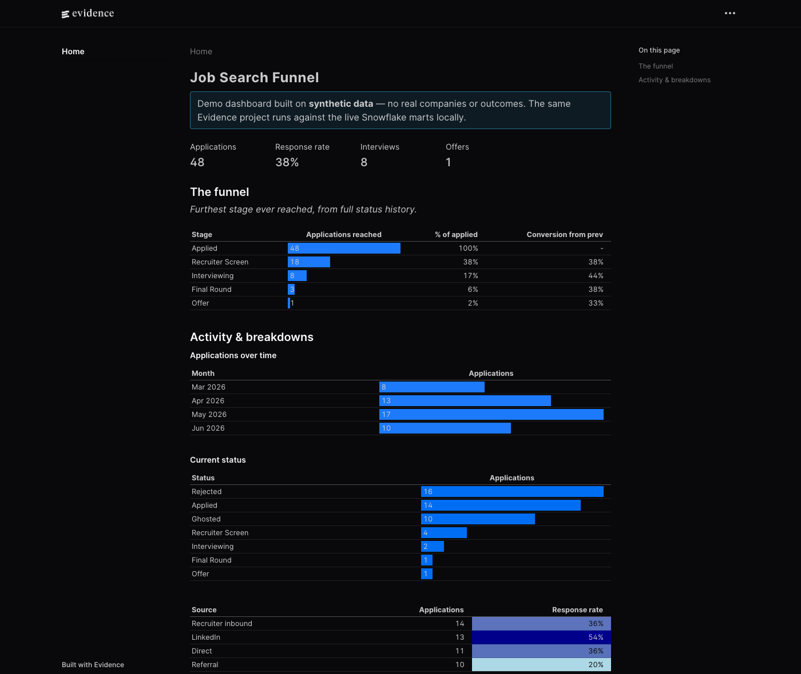

# Daily OS Bot

[](https://github.com/sebastianmukuria/daily-os-bot/actions/workflows/pipeline-tests.yml)
[](https://github.com/sebastianmukuria/daily-os-bot/actions/workflows/warehouse.yml)

A personal AI assistant that runs your life ops over Telegram — powered by Claude, backed by [Notion](https://notion.so), Google Calendar, and Gmail. Message it in plain English and it manages tasks, projects, habits, reading lists, and calendar events. In the background, it **automatically tracks your job search by reading your inbox**: every application, interview invite, and rejection becomes a structured, queryable pipeline in Notion — no manual status updates.

Built ADHD-first: tasks ordered by energy level, smallest-next-step framing, a few fixed check-in windows instead of random pings, and proactive "want me to time-block this?" prompts.

```
You:  add: call the dentist, low energy
Bot:  ✓ Created "Dentist Call 🦷" (Low energy)

You:  took my vitamins
Bot:  ✓ Take Vitamins 💊 — 4-day streak 🔥

(20 min after a rejection email lands, unprompted:)
Bot:  ❌ ExampleCorp — Data Analyst: now Rejected  [Gmail link]
```

## Demo



*Left → right: applications auto-detected and logged from the inbox (zero manual updates); a one-line request turned into an auto-enriched task plus a protected calendar time-block; and the proactive ADHD morning briefing with tasks ordered by energy. Recreated from real production output, running on my own job search.*

## Contents

- [What this demonstrates](#what-this-demonstrates)
- [What it does](#what-it-does)
- [Architecture](#architecture)
- [The job pipeline tracker](#the-job-pipeline-tracker)
- [Analytics warehouse (Snowflake + dbt)](#analytics-warehouse-snowflake--dbt)
- [Setup](#setup)
- [Project structure](#project-structure)
- [The proactive layer](#the-proactive-layer)
- [Limitations & roadmap](#limitations--roadmap)

## What this demonstrates

Built as a hands-on portfolio piece while pivoting toward data/analytics — the transferable skills, and where each one lives:

| Area | In this project |
|---|---|
| **Classification + evaluation** | An LLM email classifier gated by a deterministic prefilter, validated against a labeled fixtures set in CI — tuned for recall, since a false negative silently drops a real application |
| **ETL / data ingestion** | Idempotent Gmail → Notion pipeline: extract (poll + parse), transform (classify + state machine), load (dedupe by thread-id), plus a 90-day historical backfill |
| **Analytics engineering** | The modern stack end-to-end: Notion → Snowflake (VARIANT) → **dbt** staging/marts with tests + docs, scheduled in CI, surfaced in an **Evidence** dashboard (BI-as-code) — a funnel mart with stage conversion as the headline |
| **Data modeling** | Per-role application records + a separate `Pipeline Events` transition log, modeled for funnel analytics |
| **Analytics thinking** | Funnel framing (conversion per stage, time-in-stage) and a daily pipeline digest |
| **Testing & CI** | 40+ assertions across 5 suites, run by GitHub Actions on every relevant PR |
| **Shipping** | 30+ reviewed PRs; deployed and running in production |

## What it does

- **Tasks / Projects / Ideas / Reading list** — full CRUD in Notion via natural language. New tasks are auto-enriched: inferred energy level, type, and a link to the right project.
- **Habits** — a dedicated tracker with streaks ("took my vitamins" → checked off, streak bumped). Habits are recurring, so they live apart from one-off tasks.
- **Calendar** — create, edit (never duplicate), and query Google Calendar events; times inferred from context.
- **Job pipeline (the headline)** — a background job polls Gmail, classifies job-search emails, and drives a per-application state machine in Notion. Instant Telegram alerts on rejections / interviews / offers; low-confidence cases ask instead of guessing.
- **Web search** — server-side search for "find me details on this event" flows, with results reusable for calendar adds.
- **Reply-context** — reply to any earlier message (like an automated digest) and the bot reads it, so "add the 2nd one to my calendar" just works.

## Architecture

One Python process, three execution contexts:

```
                       ┌─────────────────────────────────────────┐
 You ──▶ Telegram ──▶  │  REACTIVE   message handler + commands  │
                       │             (Claude agentic tool loop)  │
                       │                                         │
 Gmail ◀── poll ────▶  │  PERIODIC   JobQueue: pipeline_poll     │──▶ Notion
                       │             every 20 min                │──▶ Telegram alerts
                       │                                         │
 Calendar ◀─ watch ──▶ │  HOURLY     interview reminders +       │
                       │             post-interview debriefs     │
                       └─────────────────────────────────────────┘
```

The reactive path runs a manual agentic loop: Claude gets ~20 tools (Notion CRUD, Calendar, habits, pipeline, web search); tool calls are executed and fed back until it has a final answer. The periodic paths reuse the exact same domain logic, so manual and automated writes can't diverge.

## The job pipeline tracker

The most engineering-dense part of the repo — an email-driven ETL pipeline with a review-before-write workflow:

1. **Two-pass classification.** A deterministic prefilter (ATS sender domains, interview-scheduling recipients, recruiting language) gates a Claude structured-output classifier, so the LLM only sees genuinely job-shaped email. Known false-positives — apartment-rental and OAuth "applications" — are filtered by rule. Validated against a fixtures file of 17 labeled emails that runs in CI.
2. **Pure state machine.** `(current_status, event_type, confidence) → action`. Forward-only progression (an old email can't move you backward), rejection/offer override, sub-0.85-confidence routes to a human confirm instead of a write. 10 unit tests.
3. **Per-role matching.** Records are per-role, not per-company. Tiered matching (exact → edge → substring) keeps "Analyst I" and "Analyst II" at the same company separate — and ambiguity returns candidates for a human decision rather than guessing.
4. **Idempotent ingestion.** A Gmail label is the processing ledger; Notion writes dedupe by thread-id. Every status change appends to a `Pipeline Events` log for funnel analytics (conversion per stage, time-in-stage).
5. **90-day backfill.** A one-time script reconstructs historical applications: thread-id union-find groups emails per application, chronological replay through the state machine derives final status, real email timestamps stamp the dates. Dry-run by default, prints a reviewable plan, optionally validates against a known-state file, and resumes from an incremental classification cache (rate-limit-safe).

## Analytics warehouse (Snowflake + dbt)

Notion is the operational store; for analytics the data is modeled in a proper warehouse using the modern **ELT** stack — extract-load raw, then transform in-warehouse with version-controlled, tested SQL.

```
Notion ──(el_notion.py)──▶ Snowflake RAW ──(dbt)──▶ STAGING ──(dbt)──▶ MARTS
         every page as                cast + rename        fct_/mart_ + tests
         VARIANT JSON                 (one stg_ per DB)     (funnel, tasks, habits…)
```

- **Extract-load** ([el_notion.py](el_notion.py)) snapshots all seven Notion databases into `RAW.NOTION_PAGES`, landing each page's properties as a Snowflake **VARIANT** — so the loader is schema-agnostic and all typing happens in dbt.
- **Staging** parses the VARIANT into typed columns (one `stg_` model per database; a `strip_emoji` macro normalizes `🟢 Done` → `Done`).
- **Marts** model the analytics: `fct_applications`, `fct_pipeline_events`, `fct_tasks`, `fct_habits`, and the headline **`mart_funnel`** — applications reaching each stage (from current status *and* full transition history) with stage-over-stage conversion.
- **Tested + documented** — `unique` / `not_null` / `accepted_values` / `relationships` tests and column docs across staging and marts, run by `dbt build`.
- **Orchestrated** by a scheduled [GitHub Action](.github/workflows/warehouse.yml): daily EL → `dbt build`, Snowflake creds in repo secrets.

Auth is **key-pair** (MFA-safe and CI-friendly): generate an RSA key pair, register the public half on your user (`ALTER USER <you> SET RSA_PUBLIC_KEY='...'`), and point `SNOWFLAKE_PRIVATE_KEY_PATH` at the private key. Run it locally: `pip install -r requirements-warehouse.txt`, set the `SNOWFLAKE_*` vars, then `python3 el_notion.py && cd dbt && dbt build --profiles-dir .`

### Dashboard ([Evidence](https://evidence.dev))

The marts feed an Evidence dashboard — BI-as-code (SQL + markdown, version-controlled, deploys as a static site). The committed demo runs on **synthetic data** so it's safe to share publicly; the same project points at the live Snowflake marts locally, so real job-search data never leaves the machine.



Run it: `cd evidence && npm install && npm run sources && npm run dev`.

## Engineering practices

- **PR-based development** — every change lands through a reviewed pull request (30+ and counting), squash-merged with CI.
- **Tests where they pay rent** — the pure logic (classifier prefilter, state machine, ingest planner, backfill grouping, interview windows) is unit-tested: 40+ assertions across 5 suites, run by GitHub Actions on relevant PRs.
- **Dry-run before write** — the seeder and backfill both print a full plan and touch nothing without an explicit `--apply`.
- **Honest failure reporting** — every tool result is logged (with tracebacks) and surfaced to the user as explicit per-action ✓/✗, never silently swallowed.

## Setup

Fair warning: this is a personal single-user system, not a packaged product. Expect ~30–60 minutes of API setup.

1. **Install:** `pip3 install -r requirements.txt`
2. **Configure:** `cp .env.example .env` and fill it in (Telegram bot token + chat ID, Anthropic API key, Notion integration token). See the comments in [.env.example](.env.example).
3. **Notion:** create your databases (Tasks, Projects, Ideas, Reading, Habits, Job Pipeline, Pipeline Events) and share each with your integration, then set the data-source IDs at the top of [tools.py](tools.py). Schemas are documented inline.
4. **Google:** create a Cloud project, enable the Calendar + Gmail APIs, download OAuth desktop credentials as `credentials.json`, then run `python3 auth_google.py` (writes `token.json`; prints a `GOOGLE_TOKEN_JSON` value for cloud deploys).
5. **Run:** `python3 bot.py`

### Deploying (Railway / Render)

The `Procfile` runs the bot as a worker. Set every `.env` variable in the host's dashboard — including `GOOGLE_TOKEN_JSON`, because ephemeral filesystems lose `token.json` on redeploy. Merges to `main` auto-deploy if you connect the repo.

> ⚠️ Run exactly **one** instance per Telegram bot token — two pollers conflict.

### Configuration

| Variable | Purpose | Default |
|---|---|---|
| `TELEGRAM_TOKEN` / `TELEGRAM_CHAT_ID` | Bot identity; the single chat it serves | required |
| `ANTHROPIC_API_KEY` | Claude API | required |
| `NOTION_TOKEN` | Notion integration | required |
| `GOOGLE_TOKEN_JSON` | OAuth token for cloud deploys | falls back to `token.json` |
| `CLAUDE_MODEL` | Chat model | `claude-haiku-4-5` |
| `CLASSIFIER_MODEL` | Email classifier model | `claude-haiku-4-5` |
| `SCOUT_MODEL` | DC events scout (web search + curation) model | `claude-sonnet-4-6` |
| `EVENT_MODEL` | Inbox→calendar extraction model | `claude-haiku-4-5` |
| `PIPELINE_POLL_MINUTES` | Gmail poll cadence | `20` |
| `HEALTHCHECK_HOUR` | Daily Gmail-auth check (ET); also runs at startup, alerts on failure | `7` |
| `BACKFILL_PACE_SEC` | Backfill classification pacing | `1.4` |

## Project structure

| File | Purpose |
|---|---|
| `bot.py` | Telegram handlers, Claude agentic loop, JobQueue scheduling, formatting |
| `tools.py` | Tool schemas + implementations: Notion (tasks/projects/ideas/reading/habits/pipeline), Calendar, Gmail |
| `pipeline_classifier.py` | Prefilter + LLM email classification (structured output) |
| `pipeline_state.py` | Pure state machine + per-role matching |
| `pipeline_ingest.py` | Plan + apply: classified email → Notion writes / Telegram alerts |
| `pipeline_interviews.py` | Interview detection, reminder + debrief windows (pure) |
| `pipeline_backfill.py` | One-time 90-day historical reconstruction (dry-run first) |
| `seed.py` | Idempotent bulk-seeder for projects/tasks/ideas from YAML |
| `el_notion.py` | EL job: snapshot all Notion DBs → Snowflake `RAW.NOTION_PAGES` (VARIANT) |
| `dbt/` | dbt Core project: staging + marts models, tests, docs, macros |
| `evidence/` | Evidence.dev dashboard (BI-as-code) on synthetic demo data |
| `test_*.py`, `fixtures/` | Unit tests + labeled email fixtures (run in CI) |
| `auth_google.py` | One-time Google OAuth (Calendar + Gmail scopes) |

## The proactive layer

Beyond answering messages, the bot pushes scheduled briefings to the same chat — all running in-process on the JobQueue (no separate agent), so manual and automated paths reuse the exact same domain logic:

- **Morning briefing** (7:30am ET) — today's calendar (across *all* calendars) plus tasks ordered by energy, project check-ins, and stale-task flags.
- **Midday check** (12:30pm) — done-vs-open count, afternoon events, top remaining tasks.
- **End-of-day wrap** (6pm) — what got done, what's rolling to tomorrow, tomorrow's calendar.
- **Inbox → Calendar sync** (8am + 6pm) — scans recent mail for flights / hotels / reservations / tickets, extracts them with an LLM (structured output), dedupes against the calendar, and adds them (notifying only when something's created).
- **DC events scout** (Thu + Sun, 10am) — web-searches and curates local events for the week ahead.

The reactive briefings are deterministic formatters (unit-tested, no per-run LLM cost); the inbox sync and events scout use Claude where judgment is needed. The bot's reply-context feature closes the loop — reply to any briefing to act on it ("add the 2nd one to my calendar").

## Limitations & roadmap

- **Single-user by design** — one chat ID, one Notion workspace, no multi-tenancy.
- Notion database IDs are constants in `tools.py`; provisioning them is manual (a setup script is a welcome contribution).
- Conversation memory is in-process (last 20 messages) — restarts forget context.
- Pipeline analytics (conversion rates, time-in-stage from `Pipeline Events`) are logged but not yet reported.

## Development workflow

Common tasks are wrapped in a `Makefile` — `make help` lists them (`make test`, `make warehouse`, `make dashboard`, `make report`).

```bash
git checkout -b descriptive-branch-name
# ...make changes...
make test      # run all unit suites (override interpreter: make test PYTHON=python3.11)
git add -A && git commit -m "describe the change"
git push -u origin descriptive-branch-name
gh pr create   # CI runs the pipeline tests; review, then squash-merge
```

## Security

Secrets live in `.env`, `token.json`, and `credentials.json` — all gitignored, never committed. Personal data files (`seed_data.yaml`, `backfill_cache.json`, `backfill_targets.json`) are gitignored too. The bot answers only the configured `TELEGRAM_CHAT_ID`, Gmail access is read-plus-label only (it never archives, deletes, or sends mail), and every fixture in this repo is synthetic.

## License

[MIT](LICENSE)
